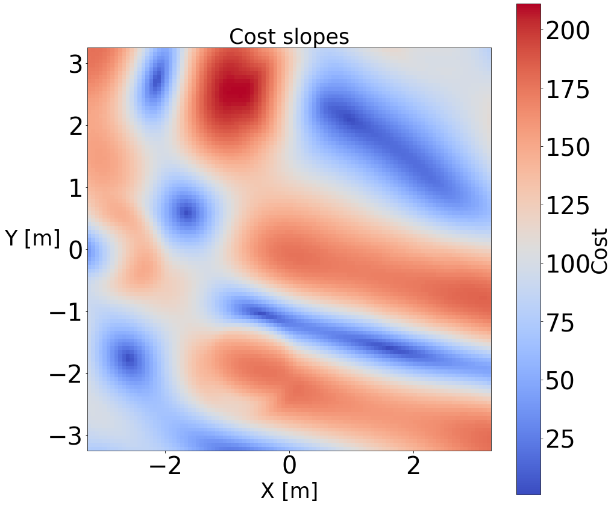
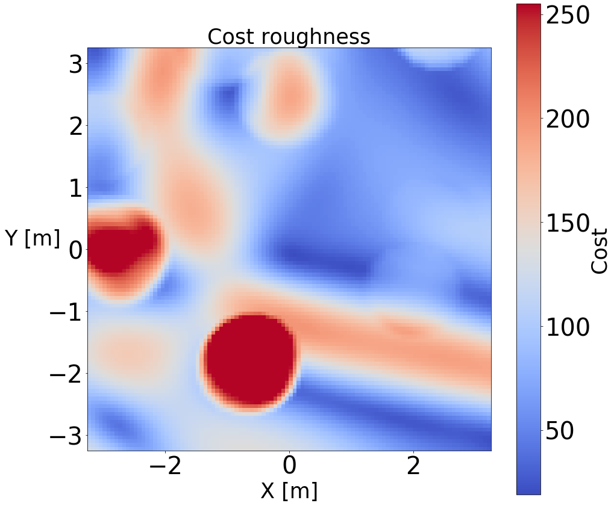
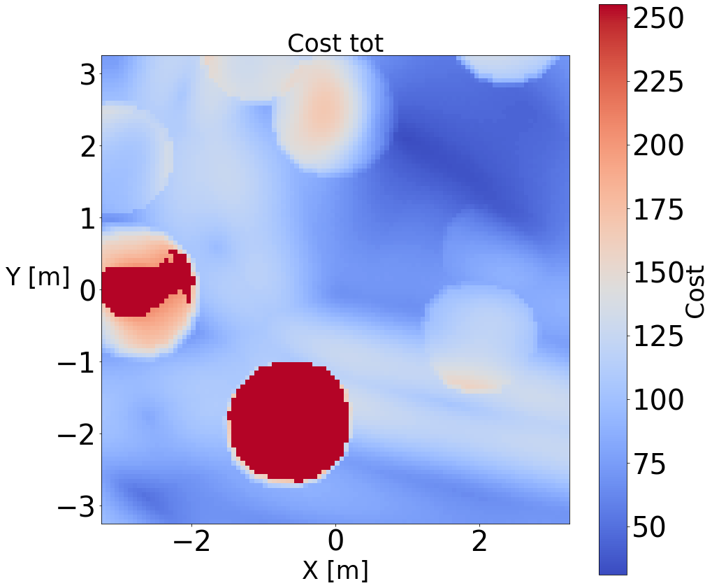
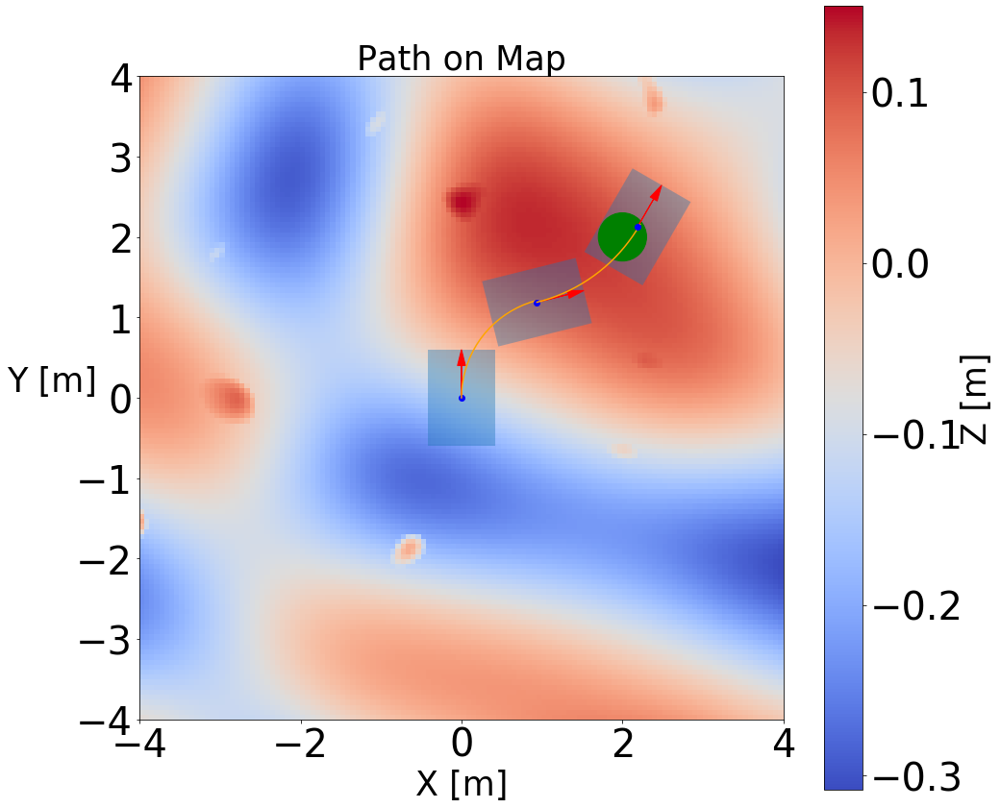

# Mobile Robot Guidance in Unstructured Terrains 
This repo includes an example implementation of guidance of mobile robot in unstructured natural environments.
Three main utilities are provided:
- Random generation of unstructured environments using the OpenSimplex algorithm
- Geometric traversability analysis for wheel robots
- A* on a lattice space path planning algorithm

## 1. Natural terrain generation with OpenSimplex
The [Opensimplex Python API](https://github:com/lmas/opensimplex) is used along with some filtering techniques to render realistic terrains.

This is done by instantiate a `terrain_generator.OpenSimplex_Map` object with the following parameters:
- __*map_size*__: size in metres of the squared-map from *-map_size/2* to *map_size/2*
- __*discr*__: discretization in metres of each map cell
- __*terrain_type*__: 5 options are defined (`mountain_crater`, `smooth`, `rough`, `wavy`, `scattered_sharp`), which differently set the parameters of the filters

Then, a new sample is generated by calling the `sample_generator` method.

```python
import terrain_generator as tg
terrain = tg.OpenSimplexMap(map_size, discr, "wavy")
terrain.sample_generator(plot=True)
```

The map matrix can be accessed by calling  `terrain.Z`. Upon initialization, it is also possible to change each filter parameter individually (for example: `terrain.perc_obstacles = 0.12`). The full list of parameters can be found in the class definition.
<p align="center">

</p>


## 2. Traversability Analysis
A geometric traversability analysis is performed with a similar method to what NASA developed for the [Martian Exploration Rovers](https://ieeexplore.ieee.org/document/1035370). It assigns to the map points a traversability value from 0 (super safe) to 255 (super unsafe). The traversability analysis is composed of an **obstacle**, **slope** and **roughness** test. Then, the three tests are averaged to compute the final traversability cost.

This is done by instantiate a `traversability_test.Traversability_Map` object with map and robot parameters as in the following:
```python
import traversability_test as tt
cost_map = tt.Traversability_Map(map_size, discr, plot = plot, width = width, 
                                     length = length, rover_clearance = rover_clearance,
                                     max_pitch = max_pitch, residual_ratio = residual_ratio,
                                     non_traversable_threshold = non_traversable_threshold)
cost_map.analysis(Z = terrain.Z)
```
Where `residual_ratio` is a parameter which controls the robot capabilities to withsand rough terrain, and `non_traversable_threshold` is the traversability threshold for considering a point as traversable, while the other parameters are self-explanatory. The final cost map can be accessed by calling `cost_map.tot`.

It is also important to highlight that not the whole the map is considered for traversability analysis, as the borders are excluded (we don't have enough information for these areas). For example, for a map of 8x8 metres and a robot of width = 0.835m, and length = 1.198m the traversable map is 6.54x6.54 metres (the size of the excluded portion is dependent on the robot dimension).






## 3. A* Path Planning
A* is a classical graph search method to perform weighted path planning. However, the standard algorithm plans actions in a grid-space. Conversely, here A* is implemented in a lattice space, where the actions correspond to arcs, straight lines or rotations definable by the user and according to the specific robot mobility capabilities (a detailed definition of creating new actions is given in `main.py`).

```python
import A_star_lattice as astar
path = astar.A_star_Graph(cost_map.map_size_tr, cost_map.map_size_tr, discr, 
                              cost_map.tot, goal, start, goal_radius = goal_radius, 
                              forward_length = forward_length,
                              rotation_cost_factor = rotation_cost_factor, 
                              forward_cost_factor = forward_cost_factor, plot = plot,
                              all_actions = all_actions, forward_actions = forward_actions)
path.search()
```
First, a `A_star_lattice.A_star_Graph` object is defined with: cost map parameters, starting and goal positions, action definition, and action cost factors. Then, `path.search()` run the A* algorithm. Finally, the optimal trajectory coordinates, actions and costs computed by A* can be accessed by calling `path.states`, `path.actions`, and `path.costs` respectively. Here, an example of planned trajectory in the cost map, and elevation map.

.
